# 基于springboot的植物健康系统

<h4 style='color:red'>联系不到我，就看我的主页 </h4> 
 
#### 介绍

我开发了一个基于SpringBoot的植物健康系统，旨在通过全面的信息管理和高效的工作流程，提升植物健康管理的效率和效果。该系统主要服务于管理端、普通员工端和技术人员端三类用户。管理端负责整个系统的维护和各类数据的管理，普通员工端负责日常的植物健康检查和记录，技术人员端则负责提供技术支持和方案。通过这一系统，不同角色的用户可以高效协作，共同提升植物的健康状况。

#### 技术栈

后端技术栈：Springboot+Mysql+Maven

前端技术栈：Vue+Html+Css+Javascript+ElementUI

开发工具：Idea+Vscode+Navicate

#### 系统功能介绍

管理端

个人中心：管理个人信息，包括修改密码和更新联系方式。  
普通员工管理：管理普通员工的信息，包括添加、删除和编辑员工数据。  
技术人员管理：管理技术人员的信息，确保技术团队的有效运作。  
植物疾病案例管理：记录和管理植物疾病的案例，提供参考和学习资料。  
植物种类管理：管理系统内所有植物种类的信息，确保数据的全面和准确。  
普通植物检查登记管理：管理普通植物的检查记录，确保检查工作有序进行。  
珍贵植物检查登记管理：特别管理珍贵植物的检查记录，确保其健康状况得到充分关注。  
植物技术方案管理：管理植物救治和保养的技术方案，提供给员工和技术人员参考。  
植物救治用料登记管理：记录和管理植物救治过程中使用的材料。  
植物救治材料管理：管理和分类所有植物救治材料的信息，确保材料供应充足。  

普通员工端

植物疾病案例：查看和学习植物疾病的案例，提升专业知识。  
植物健康论坛：参与讨论，分享和获取植物健康相关的信息。  
植物健康资讯：获取最新的植物健康资讯，了解行业动态。  
个人中心：管理个人信息，包括修改密码和更新联系方式。  
后台管理：  
植物疾病案例管理：记录和管理遇到的植物疾病案例。  
植物种类管理：更新和维护植物种类信息。  
普通植物检查登记管理：记录普通植物的健康检查信息。  
珍贵植物检查登记管理：记录珍贵植物的健康检查信息。  
植物技术方案管理：参考和实施植物救治技术方案。  
植物救治用料登记管理：记录使用的救治材料。  
植物救治材料管理：管理和使用救治材料。  
咨询专家：向技术专家咨询植物健康问题，获取专业建议。  

技术人员端

植物疾病案例：查看和研究植物疾病案例，提供技术支持。  
植物健康论坛：参与讨论，分享和获取专业信息。  
植物健康资讯：获取最新的植物健康资讯，了解最新技术和方法。  
个人中心：管理个人信息，包括修改密码和更新联系方式。  
后台管理：  
植物疾病案例管理：记录和管理复杂的植物疾病案例。  
植物种类管理：更新和维护植物种类信息。  
普通植物检查登记管理：记录普通植物的健康检查信息。   
珍贵植物检查登记管理：记录珍贵植物的健康检查信息。  
植物技术方案管理：开发和管理植物救治技术方案。  
植物救治用料登记管理：记录和管理救治用料。  
植物救治材料管理：管理和分类救治材料。  
材料类目管理：分类和管理救治材料的类别。  
咨询专家：向其他专家咨询，解决复杂问题。  

#### 系统作用

管理端的作用  

系统维护：通过个人中心和系统管理，确保系统正常运行。  
数据管理：管理普通员工、技术人员和各类植物的信息，确保数据的准确性和完整性。  
资源调配：通过植物技术方案管理和救治材料管理，合理调配资源，提高工作效率。  

普通员工端的作用  

信息记录：通过各种管理模块，记录植物的健康检查信息，确保信息的完整性。  
专业提升：通过植物疾病案例和健康资讯，不断提升专业知识和技能。  
工作交流：通过植物健康论坛和咨询专家，分享经验和获取帮助，提高工作质量。  

技术人员端的作用  

技术支持：通过研究植物疾病案例和管理技术方案，提供专业的技术支持。  
资源管理：管理和分类救治材料，确保材料的供应和使用。  
问题解决：通过咨询专家和参与论坛，解决复杂的植物健康问题。  

#### 系统功能截图

代码结构

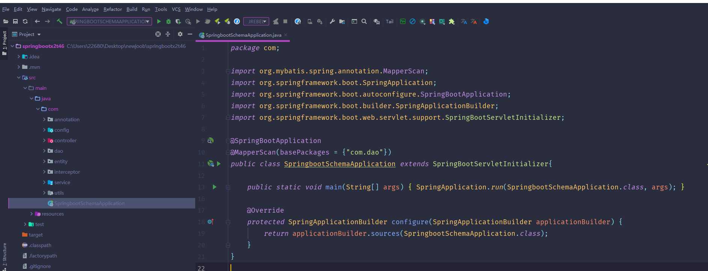

数据库表

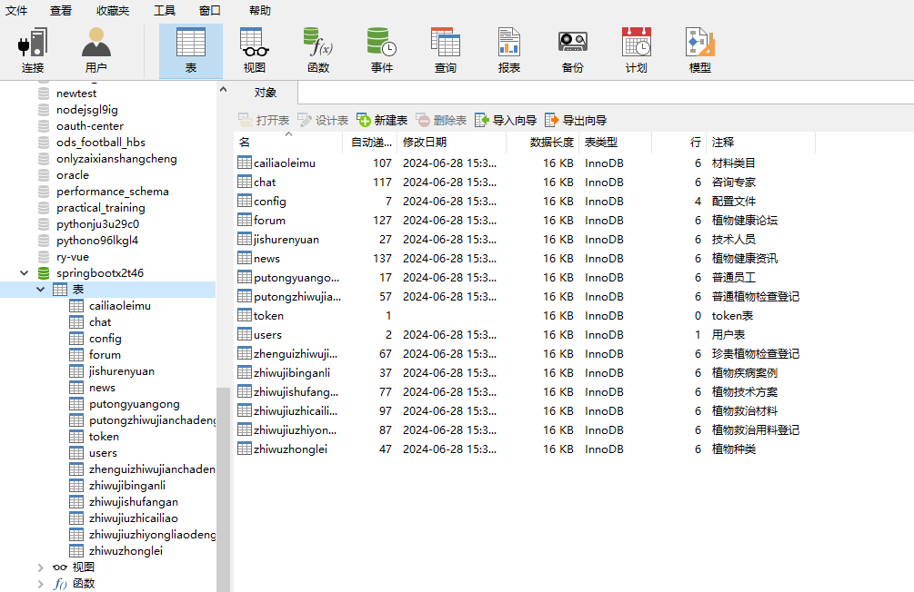

登录

前台页面首页

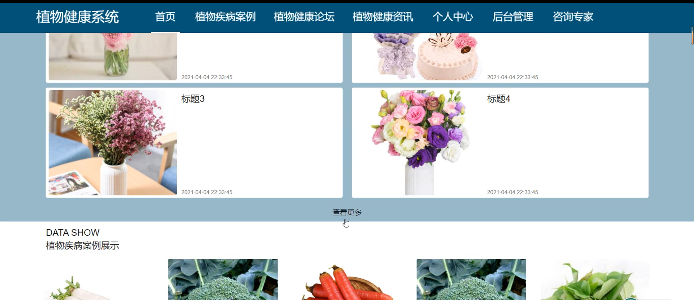

个人中心

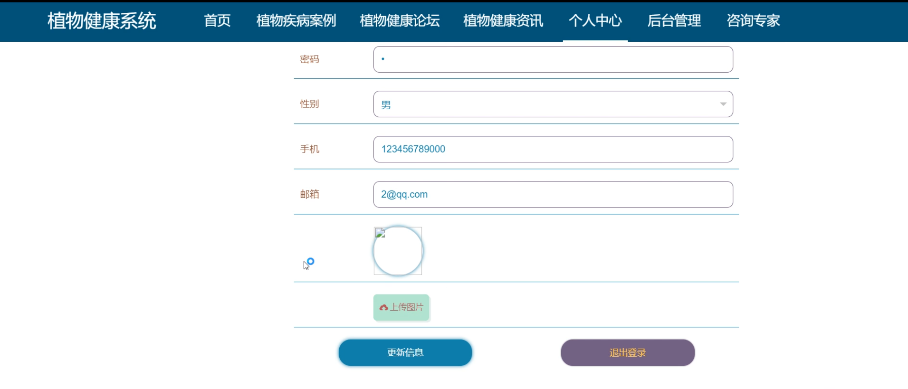

咨询专家

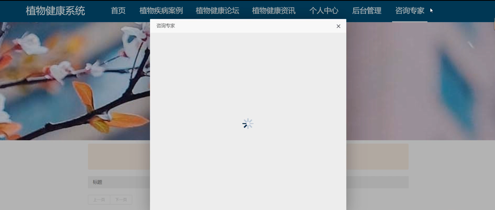

普通员工后台管理

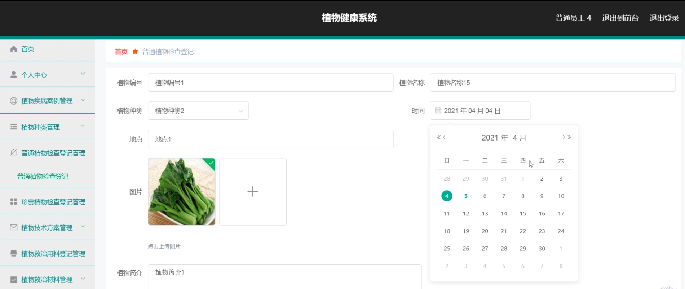

珍贵植物检查登记管理

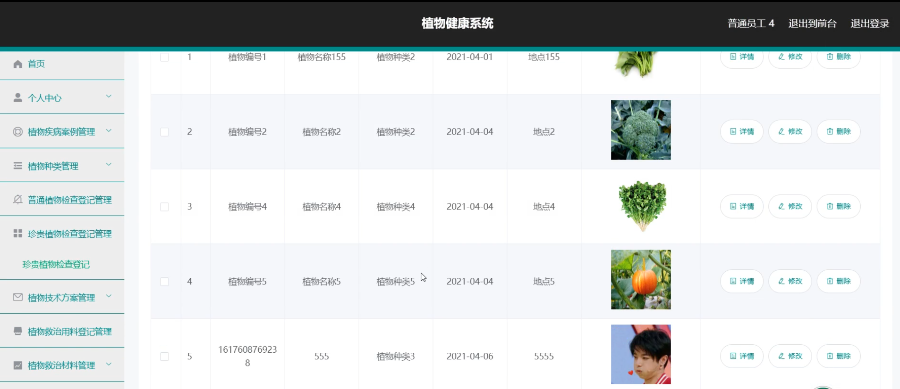

植物救治材料管理

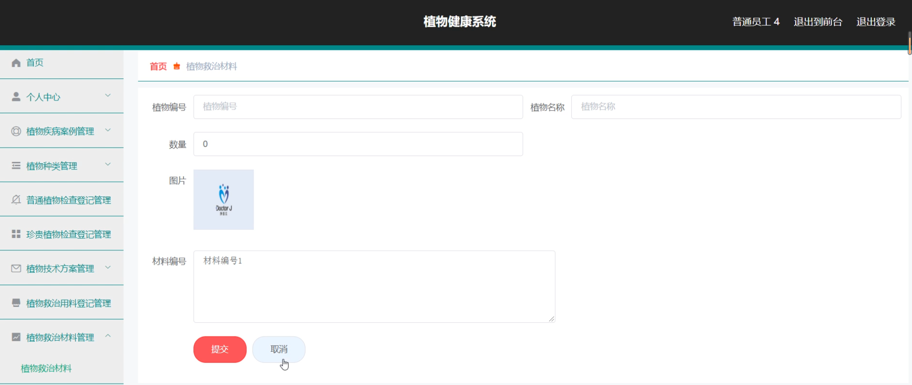

材料类目管理

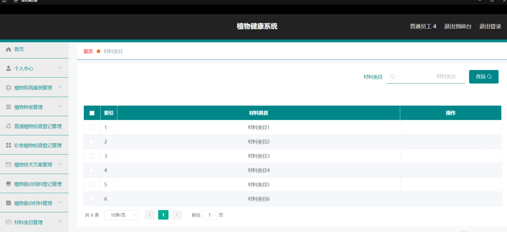

植物健康论坛

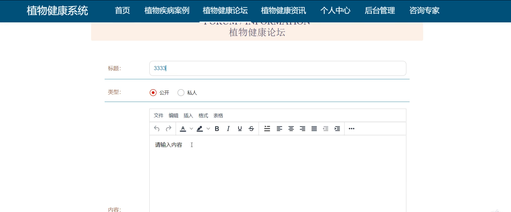

技术人员后台管理

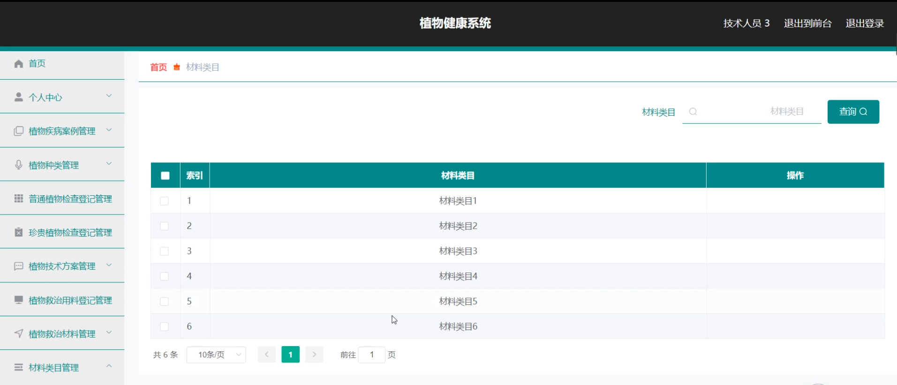

管理员端员工管理

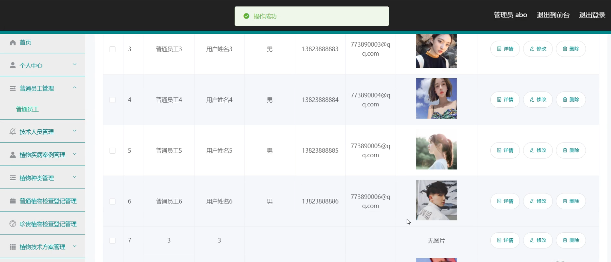

管理员端材料类目管理

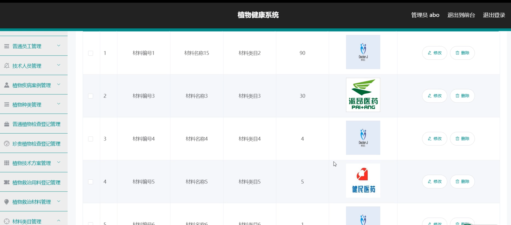

#### 总结

基于SpringBoot的植物健康系统通过精细的角色分工和功能模块设计，实现了不同角色用户之间的高效协作。管理端负责系统的总体维护和数据管理，普通员工端负责日常的植物健康检查和记录，技术人员端则提供专业的技术支持。通过这一系统，各类植物的健康状况得到了全面的关注和管理，提升了植物健康管理的效率和效果，为植物的健康成长提供了有力保障。

#### 使用说明

创建数据库，执行数据库脚本 修改jdbc数据库连接参数 下载安装maven依赖jar 启动idea中的springboot项目

后台地址：http://localhost:8080/springbootx2t46/admin/dist/index.html

管理员  abo 密码 abo

前台地址：http://localhost:8080/springbootx2t46/front/index.html

